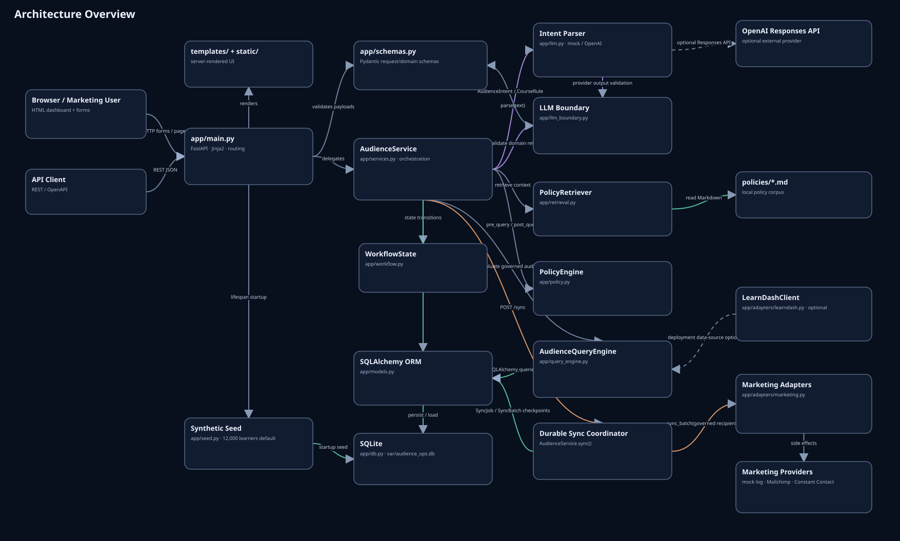

# AI Audience Ops

**Governed AI audience orchestration with hard LLM trust boundaries, deterministic policy controls, human approval, and checkpoint-based failure recovery.**

[](https://ai-audience-ops.onrender.com/)
[](https://youtu.be/2HA97gkdYY8)
[](https://treeflow-ai.github.io/ai-audience-ops/architecture/)
[](docs/SYNC_RESILIENCE.md)

> **AI interprets business language. Deterministic application code owns authorization, privacy controls, approval state, and downstream side effects.**

## Start here

| Time | Fastest way to evaluate the project |
|---|---|
| **~2 min** | [Watch the recruiter demo](https://youtu.be/2HA97gkdYY8) — governance, human approval, and failure recovery |
| **~5 min** | [Open the live demo](https://ai-audience-ops.onrender.com/) — try the built-in scenarios and inject a partial sync failure |
| **Technical deep dive** | [Explore the interactive architecture](https://treeflow-ai.github.io/ai-audience-ops/architecture/) — system view, lifecycle, state machine, ERD, LLM guardrails, durable sync, and test coverage |

[](https://youtu.be/2HA97gkdYY8)

## 30-second recruiter view

| Engineering proof point | What this project demonstrates |
|---|---|
| **AI with hard trust boundaries** | Natural-language requests become a validated `AudienceIntent`; the LLM cannot execute SQL, bypass consent/suppression rules, approve its own request, or directly trigger marketing side effects. |
| **Governance before execution** | Raw contact-data export is blocked before audience evaluation, large releases require human approval, and decisions are captured in an auditable workflow. |
| **Failure recovery, not just the happy path** | Durable `SyncJob` / `SyncBatch` checkpoints, stable idempotency keys, transient retry/backoff, and recovery from `SYNC_FAILED` without replaying already-successful batches. |

## Architecture at a glance

[](https://treeflow-ai.github.io/ai-audience-ops/architecture/architecture-overview.html)

**→ [Open the interactive architecture portfolio](https://treeflow-ai.github.io/ai-audience-ops/architecture/)**

The architecture portfolio provides seven implementation-backed views:

- **Architecture Overview** — components, trust boundaries, data flow, persistence, and external integrations.
- **Request Lifecycle** — natural-language request → governed audience → approval → durable synchronization.
- **Workflow State Machine** — public request states plus `SyncJob` / `SyncBatch` execution internals.
- **SQLAlchemy ERD** — tables, constraints, relationships, and persistent recovery state.
- **LLM Guardrail Pipeline** — untrusted model output → schema/boundary validation → deterministic execution.
- **Durable Sync Sequence** — idempotency, batching, leases, retries, checkpoints, and recovery.
- **Testing Architecture** — pytest structure, CI runners, security invariants, and coverage boundaries.

For the written design rationale, see [ARCHITECTURE.md](ARCHITECTURE.md).

## Try the live demo

The public demo runs on **12,000 deterministic synthetic learners** with credential-free mock marketing integrations.

- **Compliant request** → governed audience → `416` eligible recipients.
- **Raw email export** → blocked before audience evaluation.
- **Large audience** → `6,709` recipients → explicit human approval required.
- **Failure recovery** → inject a partial sync failure → preserve completed checkpoints → retry only unfinished work.

**→ [Open the live demo](https://ai-audience-ops.onrender.com/)**

The demo intentionally uses synthetic data and mock integrations. It is a reference implementation and engineering portfolio project, not a production deployment or compliance certification.

## What the project demonstrates

- Natural-language request → validated `AudienceIntent` schema.
- Explicit LLM boundary validation before policy evaluation or data access.
- Deterministic consent, suppression, active-account, and target-course controls.
- Pre-query refusal of raw-email export requests.
- Explainable audience funnel over **12,000 deterministic synthetic students**.
- Human approval for audiences above a configurable threshold.
- Privacy-preserving mock Mailchimp / Constant Contact sync by default.
- One durable logical `SyncJob` per governed request, split into persistent `SyncBatch` checkpoints.
- Deterministic job/batch idempotency keys plus an audience fingerprint bound to the governed snapshot.
- Bounded exponential retry/backoff for transient connector failures and manual recovery from `SYNC_FAILED`.
- Job/batch leases and heartbeats to reduce duplicate concurrent execution and recover expired work.
- Optional guarded adapters for OpenAI, LearnDash, Mailchimp, and Constant Contact.
- Audit history plus durable sync progress/attempt metadata.
- Automated pytest coverage and GitHub Actions CI.

The default public-demo path is credential-free: a deterministic mock intent parser, local policy retrieval, SQLite, synthetic data, and mock marketing adapters. The optional OpenAI parser uses the same downstream policy/query workflow, so switching parsers does not give the model direct database or marketing-platform authority.

## Current implementation at a glance

| Area | Current behavior |
|---|---|
| AI boundary | Mock or OpenAI intent parsing; output is validated before deterministic policy/query logic runs |
| Governance | Consent, suppression, account-state, target-course, export-blocking, and approval rules live in application code |
| Audience data | 12,000 deterministic synthetic learners by default; optional LearnDash adapter |
| Public request states | `EVALUATING`, `BLOCKED`, `REVIEW_REQUIRED`, `READY_TO_SYNC`, `APPROVED`, `SYNCED`, `SYNC_FAILED` |
| Sync execution | Synchronous HTTP coordinator backed by durable `SyncJob` / `SyncBatch` persistence |
| Idempotency | One logical job per request; stable job/batch keys; successful batches are not replayed on recovery |
| Failure recovery | Transient retry/backoff, persistent attempts/checkpoints, manual retry from `SYNC_FAILED`, expired-lease recovery |
| Real providers | Mailchimp and Constant Contact adapters are available but real sync is disabled by default |
| Operations boundary | No production queue/scheduler/dead-letter/monitoring layer; the persistence model is worker-ready, not a full worker platform |

## Run locally

### Option A — Python

Requires Python 3.11+.

```bash
python -m venv .venv
source .venv/bin/activate          # Windows: .venv\Scripts\activate
python -m pip install -e ".[dev]"
# Optional: copy only if you want overrides or real integrations
cp .env.example .env               # Windows PowerShell: Copy-Item .env.example .env
uvicorn app.main:app --reload
```

Open <http://127.0.0.1:8000>.

The first launch creates and seeds the local SQLite database automatically. The default mock configuration also works without a `.env` file; `Settings` supplies safe defaults and `load_dotenv()` simply applies a local `.env` when one exists.

### Option B — Docker

No `.env` file is required for the default mock demo:

```bash
docker compose up --build
```

Then open <http://127.0.0.1:8000>.

If you want to override defaults or enable optional integrations, copy `.env.example` to `.env` first and edit the values.

## Three built-in scenarios

### 1. Compliant audience

A Class C campaign requests learners who recently completed Class A, took Class B, match the `career_advancement` profile, and are eligible for marketing.

With the default deterministic dataset:

```text
READY_TO_SYNC
416 eligible recipients
```

The audience can be sent to the mock marketing adapter without displaying raw email addresses in the review UI.

### 2. Raw email export

The user asks for student email addresses to export to Excel.

```text
BLOCKED
0 eligible recipients
```

The request is refused **before audience evaluation**. Marketing segmentation is supported; unrestricted contact-data export is not.

### 3. Large audience / human approval

A broader Class C request targets anyone who took Class A or Class B during the last two years.

```text
REVIEW_REQUIRED
6,709 eligible recipients
```

The workflow cannot sync until the identified manager approves it. After approval, the mock adapter records a governed sync event.

Run all three from the CLI:

```bash
python scripts/run_demo.py
```


## Key engineering decisions

### AI interprets; code authorizes

The model boundary is deliberately narrow. A parser may produce a validated intent object, but it cannot execute arbitrary SQL, turn off consent/suppression controls, approve its own request, or directly write to a marketing system. Mandatory controls are normalized by application code after interpretation.

### LLM output is treated as untrusted input

`app/llm_boundary.py` keeps model output outside the authorization boundary. Parsed intent must satisfy the application-owned schema and boundary checks before deterministic policy evaluation, audience queries, approval decisions, or connector side effects can occur. This separation is tested independently in `tests/test_llm_boundary.py`; see [docs/LLM_BOUNDARY_VALIDATION.md](docs/LLM_BOUNDARY_VALIDATION.md).

### Policy retrieval is explanatory, not enforcement

`app/retrieval.py` performs small local lexical retrieval over the Markdown policy set so the UI can show relevant policy context. The actual allow/block/review decision is implemented separately in deterministic code. This is intentionally described as **policy retrieval**, not as a claim that the retrieved text itself authorizes access.

### The review UI is aggregate-only

The dashboard shows criteria, counts, policy results, approval state, and audit metadata. It does not display eligible students' raw email addresses. Mock sync logs are aggregate-only and do not persist contact-level identifiers.


### Durable synchronization is a coordinator, not a one-shot call

Each governed request maps to one persistent `SyncJob`. Recipients are split into deterministic `SyncBatch` slices with stable idempotency keys and an audience fingerprint. Completed batches are durable checkpoints. Retryable failures use bounded exponential backoff; permanent/unknown failures surface `SYNC_FAILED`; and an operator retry resumes the same logical job without resetting successful batches. Job/batch leases and heartbeats reduce duplicate concurrent work and support recovery after an expired worker lease.

The current demo runs this coordinator synchronously inside the HTTP request. The persistence model is intentionally worker-ready, but a production queue, scheduler, dead-letter flow, and distributed operations layer are outside this repository's scope.

### Public workflow state and durable sync state are separate

The public `AudienceRequest` state machine intentionally does **not** add a `SYNCING` state. In-flight work is represented by `SyncJob.status` and per-batch status instead. A request in `SYNC_FAILED` remains eligible for `POST /api/requests/{id}/sync`; that call resumes the same logical job, preserves `SUCCEEDED` batches, resets failed work for a new recovery round, and keeps lifetime attempt history.

A repeated sync after the durable job has succeeded is a no-op reconciliation rather than a second downstream release. See [docs/SYNC_RESILIENCE.md](docs/SYNC_RESILIENCE.md) for the detailed state flow and provider-specific delivery guarantees.

### External systems sit behind adapters

The domain workflow depends on adapters rather than vendor-specific calls. The repository includes:

- `LearnDashClient` for documented LearnDash course-user and user-course REST routes;
- `MockMarketingAdapter` for credential-free public demos;
- `MailchimpAdapter` for governed list-member upsert + tagging; and
- `ConstantContactAdapter` for governed V3 list + JSON bulk-import flows.

Real marketing synchronization is **disabled by default** and capped by `REAL_SYNC_MAX_RECIPIENTS`. Synchronization is coordinated through a durable job/batch layer: completed batches are committed as checkpoints, transient failures retry with the same per-batch idempotency key, and a later operator retry resumes unfinished work instead of replaying successful batches.

Mailchimp uses replay-safe member upsert/tag operations for this demo. Constant Contact bulk import is asynchronous at the API level; the adapter checkpoints its list/activity identifiers before polling so recovery can resume the accepted activity when possible. Because the Constant Contact operation used here does not expose a true client-supplied idempotency key, the implementation documents a narrow at-least-once window rather than claiming universal exactly-once delivery. See [docs/SYNC_RESILIENCE.md](docs/SYNC_RESILIENCE.md).

## Project structure

```text
ai-audience-ops/
├── app/
│   ├── adapters/
│   │   ├── learndash.py
│   │   └── marketing.py
│   ├── templates/
│   ├── static/
│   ├── config.py
│   ├── db.py
│   ├── llm.py
│   ├── llm_boundary.py
│   ├── main.py
│   ├── models.py
│   ├── policy.py
│   ├── query_engine.py
│   ├── retrieval.py
│   ├── schemas.py
│   ├── seed.py
│   └── services.py
├── policies/
├── scripts/
├── tests/
├── docs/
│   ├── LEARNDASH-INTEGRATION.md
│   ├── LLM_BOUNDARY_VALIDATION.md
│   └── SYNC_RESILIENCE.md
├── .github/workflows/test.yml
├── .dockerignore
├── Dockerfile
├── docker-compose.yml
└── pyproject.toml
```

## API

FastAPI exposes interactive OpenAPI docs at `/docs`.

Main endpoints:

```text
POST /api/requests
GET  /api/requests
GET  /api/requests/{id}
POST /api/requests/{id}/approve
POST /api/requests/{id}/sync
GET  /api/requests/{id}/sync
GET  /health
```

Example:

```bash
curl -X POST http://127.0.0.1:8000/api/requests \
  -H 'content-type: application/json' \
  -d '{
    "text": "Please create an audience for promoting Class C. Include students who completed Class A within the last 90 days, have taken Class B, match our career advancement learner profile, and are eligible to receive marketing emails. Exclude anyone who has already enrolled in Class C. Manager is Jane Smith.",
    "requested_by": "Alex Rivera — Marketing",
    "marketing_provider": "mock_mailchimp"
  }'
```

## Configuration

The default mock/demo path does not require a `.env` file. Configuration is read from environment variables, with `.env` loaded only when present. `.env.example` documents the supported overrides.

Core defaults:

```text
DATABASE_URL=sqlite:///./var/audience_ops.db
LLM_PROVIDER=mock
APPROVAL_THRESHOLD=5000
SYNTHETIC_STUDENT_COUNT=12000
ALLOW_REAL_MARKETING_SYNC=false
REAL_SYNC_MAX_RECIPIENTS=500
SYNC_BATCH_SIZE=100
SYNC_MAX_ATTEMPTS=3
SYNC_RETRY_BACKOFF_SECONDS=0.25
SYNC_LEASE_SECONDS=120
```

Never commit a real `.env` or provider credentials.

## Optional OpenAI intent parser

The default `LLM_PROVIDER=mock` is deterministic and requires no credentials.

To use an OpenAI model only for intent interpretation:

```bash
python -m pip install -e ".[llm]"
export LLM_PROVIDER=openai
export OPENAI_API_KEY=...
export OPENAI_MODEL=gpt-5.5
```

The adapter uses the OpenAI Responses API. Returned JSON is validated into `AudienceIntent`, then mandatory system controls are re-applied before any policy or query step. The model never receives SQL execution authority.

Never commit `.env` or API keys.

## Optional LearnDash integration

The included client aligns with documented LearnDash REST endpoints such as:

```text
GET /wp-json/ldlms/v1/sfwd-courses/{course_id}/users
GET /wp-json/ldlms/v1/users/{user_id}/courses
```

The public demo intentionally does **not** pretend that a generic LearnDash installation contains organization-specific consent, learner-profile, or completion-date fields. A real deployment would map those fields from WordPress user meta, LearnDash activity/reporting data, a CRM, or a reporting warehouse.

See [docs/LEARNDASH-INTEGRATION.md](docs/LEARNDASH-INTEGRATION.md).

## Optional real marketing integrations

Real sync requires both provider credentials and:

```bash
export ALLOW_REAL_MARKETING_SYNC=true
```

The default cap is 500 recipients:

```bash
export REAL_SYNC_MAX_RECIPIENTS=500
```

Durable sync controls also have safe defaults and may be overridden when needed:

```bash
export SYNC_BATCH_SIZE=100
export SYNC_MAX_ATTEMPTS=3
export SYNC_RETRY_BACKOFF_SECONDS=0.25
export SYNC_LEASE_SECONDS=120
```

Transient failures are retried within the same logical job and batch identity. `POST /api/requests/{id}/sync` on a `SYNC_FAILED` request starts a recovery round that preserves successful checkpoints. `GET /api/requests/{id}/sync` exposes durable progress and attempt metadata.

### Mailchimp

Configure:

```text
MAILCHIMP_API_KEY
MAILCHIMP_SERVER_PREFIX
MAILCHIMP_LIST_ID
```

The adapter upserts already-governed contacts and attaches an `audience:AUD-...` tag. It does not intentionally overwrite an existing member's subscription state; `status_if_new` is used only when creating a new member.

### Constant Contact

Configure:

```text
CONSTANT_CONTACT_ACCESS_TOKEN
CONSTANT_CONTACT_LIST_ID                 # optional; otherwise create a list
CONSTANT_CONTACT_ACTIVITY_TIMEOUT_SECONDS=60
```

The adapter submits the V3 JSON bulk-import activity, checkpoints the returned `activity_id`, and polls `/activities/{activity_id}` until completion. If polling later fails or times out, recovery can resume the checkpointed activity rather than intentionally submitting a new import. Real production use would normally move this durable coordination to an asynchronous job/worker rather than holding a web request open.

## Testing

```bash
pytest
```

Tests cover:

- primary intent extraction and explicit LLM-boundary validation;
- compliant audience creation and privacy-preserving mock sync;
- raw-email blocking before query execution;
- regression coverage for the detached SQLAlchemy session bug;
- application-owned consent/suppression/account/target-course controls;
- manager approval rules;
- real-sync safety guards and fail-closed preflight ordering;
- repeated-sync idempotency and no-replay behavior after success;
- retryable failure recovery with stable per-batch idempotency keys;
- preservation of successful batch checkpoints across manual retries;
- job lease contention/expiry recovery and safe provider retargeting before side effects;
- configuration/schema validation;
- repeatable database reset/seed behavior; and
- privacy-preserving mock log output.

GitHub Actions runs the suite on Python 3.11, 3.12, and 3.13 without secrets. Dependabot is configured for monthly Python and GitHub Actions dependency updates.

## Synthetic data

`app/seed.py` creates deterministic student profiles, consent/suppression flags, account status, and LearnDash-style enrollments/completions. Synthetic email addresses use `example.edu`; no real student records are included.

Reset the demo:

```bash
make reset
```

## Deliberate scope limits

This is a reference implementation, not a compliance certification or a production deployment. It intentionally does not include:

- real student data;
- SSO/RBAC or production identity management;
- security-grade immutable audit storage;
- database migrations/backups;
- a production asynchronous connector queue/worker, scheduled retry orchestration, and dead-letter handling;
- organization-specific privacy/legal rules; or
- production monitoring/alerting.

The repository **does** include synchronous durable batching, bounded transient retries, idempotency keys, leases, and checkpoint recovery; the scope limit above is specifically about production-grade asynchronous execution and operations. See [SECURITY.md](SECURITY.md) and [docs/SYNC_RESILIENCE.md](docs/SYNC_RESILIENCE.md).

## Repository documentation

- [ARCHITECTURE.md](ARCHITECTURE.md) — trust boundaries, state model, and component responsibilities.
- [SECURITY.md](SECURITY.md) — implemented safeguards, threat assumptions, and production gaps.
- [docs/LLM_BOUNDARY_VALIDATION.md](docs/LLM_BOUNDARY_VALIDATION.md) — untrusted-model-output boundary and tests.
- [docs/SYNC_RESILIENCE.md](docs/SYNC_RESILIENCE.md) — idempotency, batching, retry, leases, recovery, and provider guarantees.
- [docs/LEARNDASH-INTEGRATION.md](docs/LEARNDASH-INTEGRATION.md) — LearnDash adapter assumptions and mapping boundary.
- [DEMO.md](DEMO.md) — demo scenarios and walkthrough.
- [CHANGELOG.md](CHANGELOG.md) — notable implementation changes.

## Reference documentation

- [LearnDash REST API](https://developers.learndash.com/rest-api/v1/)
- [Mailchimp Marketing API](https://mailchimp.com/developer/marketing/api/)
- [Constant Contact V3 API](https://developer.constantcontact.com/api_reference/index.html)
- [OpenAI Python library / Responses API](https://github.com/openai/openai-python)

## License

MIT
