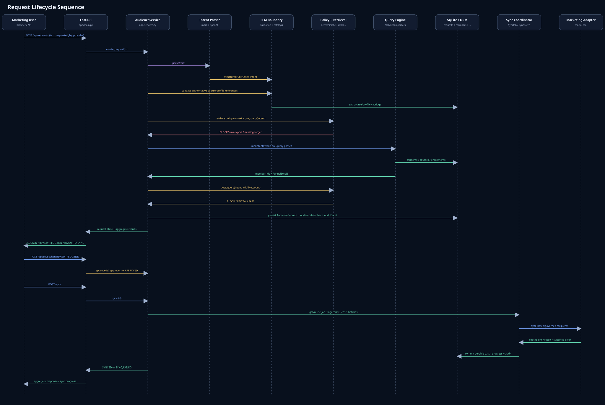
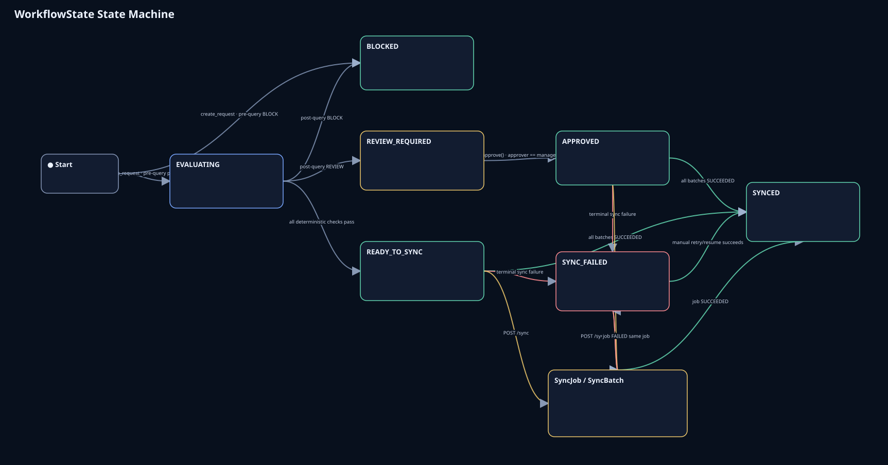
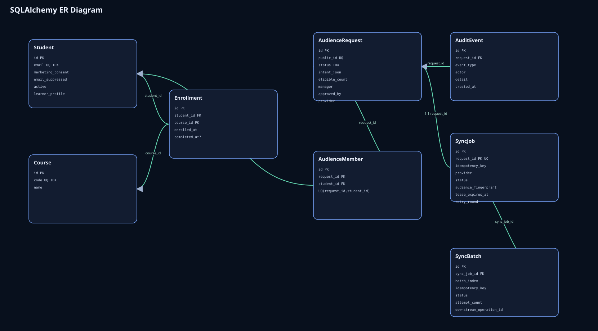
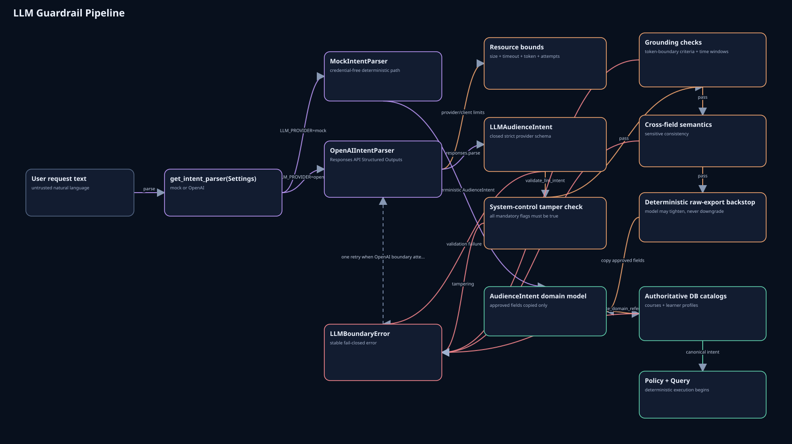
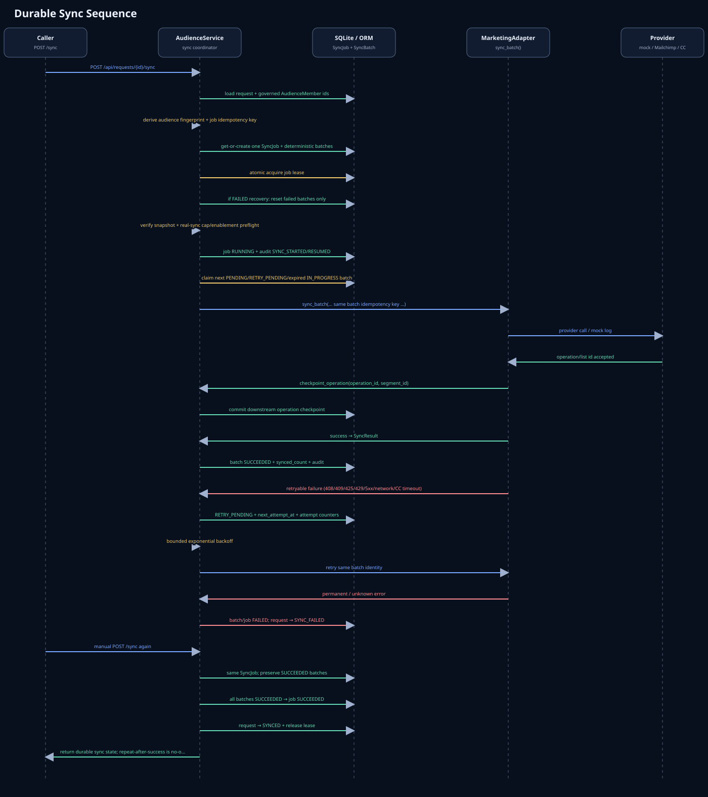
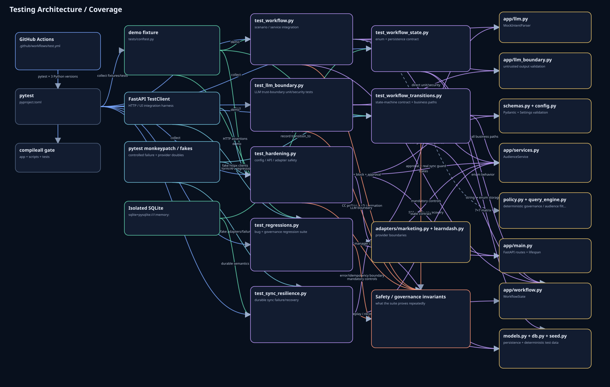

# Architecture Diagrams

These diagrams are derived from and cross-checked against the implementation in this repository. They make the runtime flow, trust boundaries, persistence model, workflow semantics, durable sync behavior, and testing strategy easier to review.

> AI interprets business language. Deterministic application code owns policy enforcement, privacy controls, approval state, data access, and downstream side effects.

The SVG previews render directly on GitHub. The HTML versions are interactive when GitHub Pages is enabled from the repository's `/docs` folder.

### Architecture Overview

System components, trust boundaries, data flow, persistence, and external integrations.

[Interactive HTML via GitHub Pages](https://treeflow-ai.github.io/ai-audience-ops/architecture/architecture-overview.html) · [HTML source](./architecture-overview.html)

### Request Lifecycle Sequence

Natural-language request → governed audience → approval → durable synchronization.

[Interactive HTML via GitHub Pages](https://treeflow-ai.github.io/ai-audience-ops/architecture/request-lifecycle.html) · [HTML source](./request-lifecycle.html)

### WorkflowState State Machine

Public workflow states, legal transitions, and SyncJob / SyncBatch execution internals.

[Interactive HTML via GitHub Pages](https://treeflow-ai.github.io/ai-audience-ops/architecture/workflow-state-machine.html) · [HTML source](./workflow-state-machine.html)

### SQLAlchemy ER Diagram

ORM tables, fields, foreign keys, constraints, and relationships.

[Interactive HTML via GitHub Pages](https://treeflow-ai.github.io/ai-audience-ops/architecture/database-erd.html) · [HTML source](./database-erd.html)

### LLM Guardrail Pipeline

How untrusted model output passes strict schema, grounding, and catalog validation before deterministic execution.

[Interactive HTML via GitHub Pages](https://treeflow-ai.github.io/ai-audience-ops/architecture/llm-guardrail-pipeline.html) · [HTML source](./llm-guardrail-pipeline.html)

### Durable Sync Sequence

Idempotency, batching, leases, retries, checkpoints, and failure recovery.

[Interactive HTML via GitHub Pages](https://treeflow-ai.github.io/ai-audience-ops/architecture/durable-sync-sequence.html) · [HTML source](./durable-sync-sequence.html)

### Testing Architecture / Coverage

pytest structure, fixtures and fakes, CI runners, security invariants, and production-code coverage.

[Interactive HTML via GitHub Pages](https://treeflow-ai.github.io/ai-audience-ops/architecture/testing-architecture.html) · [HTML source](./testing-architecture.html)

## Interaction model

All interactive views use the same navigation model: drag the diagram background to pan, use the wheel/trackpad to zoom, drag nodes/cards where supported, and use **Fit** to restore a useful overview. Pointer Events are used so panning remains consistent across the background, SVG layers, and touch-capable devices.

## Scope note

These diagrams distinguish implemented behavior from documented production gaps. The repository includes CI but does not claim a production CD pipeline, SSO/RBAC, immutable security audit storage, a production async worker/queue, or production monitoring/alerting.
